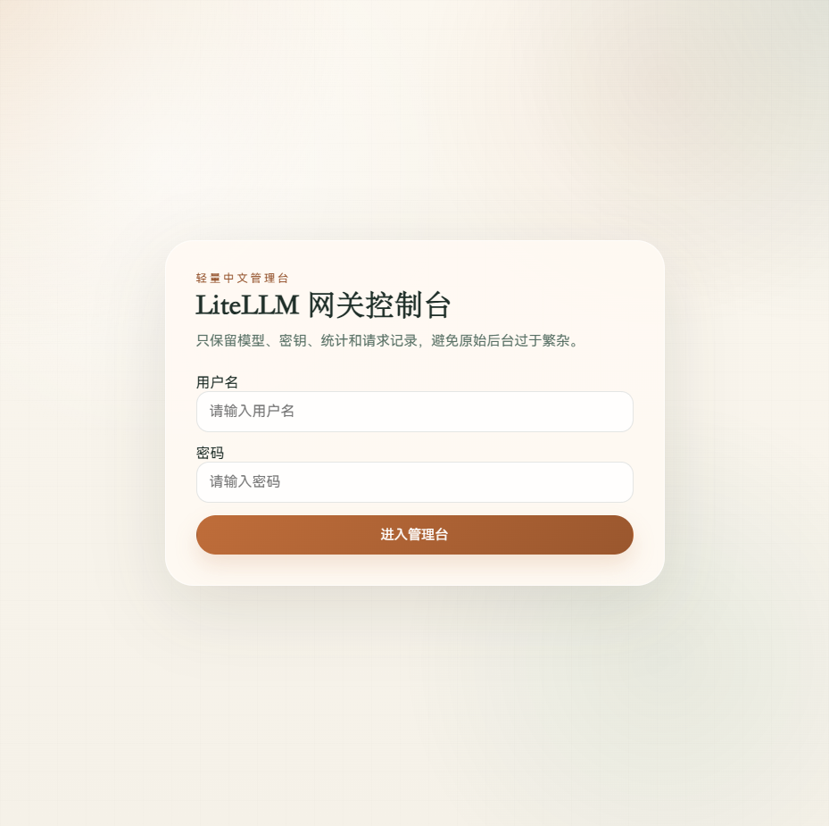
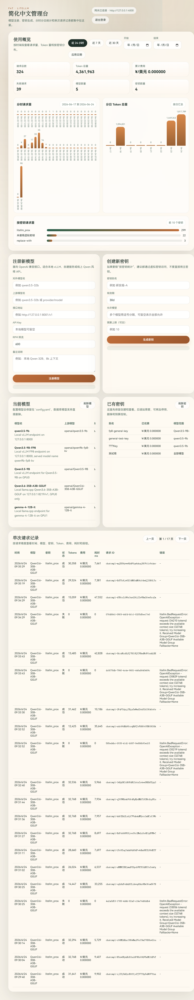

# LiteLLM CN Console

[](https://www.python.org/)
[](https://fastapi.tiangolo.com/)
[](https://github.com/BerriAI/litellm)
[](./LICENSE)

一个面向 **LiteLLM** 的简化中文管理台，聚焦模型注册、虚拟密钥管理、用量统计与请求日志查看，适合本地模型网关和小团队内部使用。

> A simplified Chinese admin console for LiteLLM, focused on model registration, virtual key management, usage analytics, and request logs.

## 界面截图

### 登录页



### 控制台首页



## 功能概览

- 中文登录页与轻量会话管理
- 查看当前 LiteLLM 模型列表
- 注册 OpenAI 兼容上游模型
- 删除数据库型模型记录
- 创建和查看虚拟密钥
- 查看分时请求量、分日 Token 总量、按密钥请求量
- 查看单次请求日志，包括模型、密钥、状态、Token、费用、耗时和错误信息

## 适用场景

- 已经部署 LiteLLM Gateway，希望补一个更易用的中文前台
- 业务团队不希望直接使用 LiteLLM 原生后台
- 需要在本地模型、vLLM、线上 OpenAI 兼容 API 之间快速注册和切换
- 希望用最小成本查看基础用量和请求明细

## 工作方式

本项目不是独立网关，而是 **LiteLLM 的前端控制台**。

它通过环境变量连接到 LiteLLM：

- `LITELLM_GATEWAY_URL`
- `LITELLM_MASTER_KEY`

当前会调用以下 LiteLLM 管理接口：

- `GET /model/info`
- `POST /model/new`
- `POST /model/delete`
- `GET /key/list`
- `POST /key/generate`
- `GET /spend/logs/v2`

## 技术栈

- Python 3.10+
- FastAPI
- Jinja2
- httpx
- 原生 HTML / CSS / JavaScript

## 项目结构

```text
litellm-cn-console/
├─ app.py
├─ requirements.txt
├─ start_simple_cn_ui.sh
├─ env.simple_ui.example
├─ Dockerfile
├─ docs/
│  ├─ login.png
│  └─ dashboard.png
├─ static/
│  ├─ app.js
│  └─ styles.css
└─ templates/
   ├─ index.html
   └─ login.html
```

## 快速开始

### 1. 安装依赖

```bash
pip install -r requirements.txt
```

### 2. 配置环境变量

复制示例文件：

```bash
cp env.simple_ui.example env.simple_ui
```

按你的环境修改：

```bash
export SIMPLE_UI_USERNAME='admin'
export SIMPLE_UI_PASSWORD='your-password'
export SIMPLE_UI_SESSION_SECRET='replace-with-random-string'
export SIMPLE_UI_PORT='4040'
export LITELLM_GATEWAY_URL='http://127.0.0.1:4000'
export LITELLM_MASTER_KEY='sk-...'
```

### 3. 启动

#### 方式一：直接运行

```bash
source env.simple_ui
uvicorn app:app --host 0.0.0.0 --port ${SIMPLE_UI_PORT:-4040}
```

#### 方式二：使用启动脚本

```bash
bash start_simple_cn_ui.sh
```

默认访问地址：

```text
http://127.0.0.1:4040/login
```

## Docker

### 构建镜像

```bash
docker build -t litellm-cn-console .
```

### 启动容器

```bash
docker run -d \
  --name litellm-cn-console \
  -p 4040:4040 \
  -e SIMPLE_UI_USERNAME=admin \
  -e SIMPLE_UI_PASSWORD=your-password \
  -e SIMPLE_UI_SESSION_SECRET=replace-with-random-string \
  -e LITELLM_GATEWAY_URL=http://host.docker.internal:4000 \
  -e LITELLM_MASTER_KEY=sk-... \
  litellm-cn-console
```

## 本地开发

```bash
pip install -r requirements.txt
cp env.simple_ui.example env.simple_ui
source env.simple_ui
uvicorn app:app --reload --host 0.0.0.0 --port 4040
```

## 安全说明

- 不建议直接暴露在公网
- 建议通过内网、VPN 或反向代理鉴权后访问
- `LITELLM_MASTER_KEY` 权限较高，应通过环境变量安全注入
- 默认实现适合单管理员或小团队内部使用

## 贡献

欢迎提交 Issue 和 Pull Request。提交前建议先阅读 [CONTRIBUTING.md](./CONTRIBUTING.md)。

## Security

如果涉及安全问题，请先阅读 [SECURITY.md](./SECURITY.md)。

## License

本项目使用 [MIT License](./LICENSE)。
